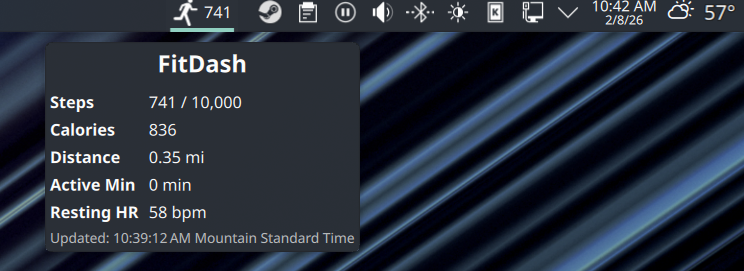

# FitDash

Fitbit step counter and fitness data widget for KDE Plasma.





## Requirements

- KDE Plasma 6
- Python 3
- A [Fitbit developer account](https://dev.fitbit.com/) (free)

## Installation

```bash
git clone https://github.com/democe/fitdash.git
cd fitdash
./scripts/install.sh
```
or

```bash
git clone https://github.com/democe/fitdash.git
cd fitdash
./scripts/package.sh
```
and install the plasmoid through plasma 'Add and Manage Widgets/Get New/Install Widget From Local File...'

## Uninstallation

```bash
./scripts/uninstall.sh
```

Or if installed from a `.plasmoid` file:

```bash
plasmapkg2 -r com.democe.fitdash
```

## Development

```bash
# Install locally
./scripts/install.sh

# Test in standalone window (requires plasma-sdk)
./scripts/test.sh

# Package for distribution
./scripts/package.sh

# Uninstall
./scripts/uninstall.sh
```

No build step required — QML is interpreted at runtime. After modifying QML files, re-run `install.sh` then `test.sh` to see changes.

## License

[GPL-3.0-or-later](https://www.gnu.org/licenses/gpl-3.0.html)

## Author

democe — [democe@outlook.com](mailto:democe@outlook.com)
