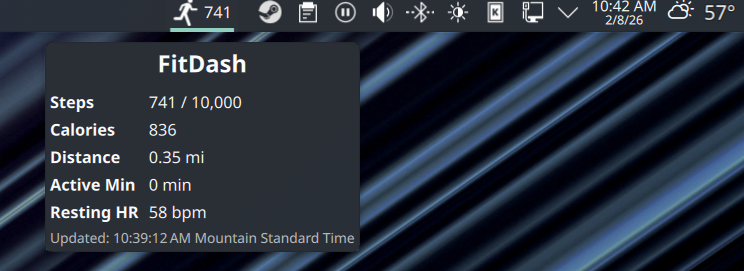

# FitDash

Fitbit's Web API shuts down 2026-09-30. This release migrates FitDash to the
**Google Health API**, its official replacement (`health.googleapis.com`), which now
serves the same activity, calorie, distance, and heart rate data for Fitbit and Pixel
Watch devices.

---

Step counter and fitness data widget for KDE Plasma, backed by the Google Health API.





## Requirements

- KDE Plasma 6
- Python 3
- A Google Cloud project with the Google Health API enabled (free) — see below

## Google Cloud setup

1. Create a project (or use an existing one) at [console.cloud.google.com](https://console.cloud.google.com/).
2. Enable the **Google Health API** for that project.
3. Configure the OAuth consent screen. Under **Data Access**, add these scopes:
   - `https://www.googleapis.com/auth/googlehealth.activity_and_fitness.readonly`
   - `https://www.googleapis.com/auth/googlehealth.health_metrics_and_measurements.readonly`

   While the consent screen is in **Testing** status, add your own Google account as a
   test user, and note that refresh tokens expire after 7 days — you'll need to
   re-authorize the widget weekly. Publishing the app removes that limit but requires
   Google's OAuth verification review for these scopes.
4. Create an OAuth 2.0 Client ID of type **Desktop app** and download its credentials.
   Google allows any `http://localhost` port for this client type automatically, so no
   redirect URI needs to be registered — FitDash's local callback (port 19847 by
   default) works out of the box.
5. Copy the Client ID and Client Secret into FitDash's settings (General tab).

## Installation

```bash
git clone https://github.com/democe/fitdash.git
cd fitdash
./scripts/install.sh
```
or

```bash
git clone https://github.com/democe/fitdash.git
cd fitdash
./scripts/package.sh
```
and install the plasmoid through plasma 'Add and Manage Widgets/Get New/Install Widget From Local File...'

## Uninstallation

```bash
./scripts/uninstall.sh
```

Or if installed from a `.plasmoid` file:

```bash
plasmapkg2 -r com.democe.fitdash
```

## Development

```bash
# Install locally
./scripts/install.sh

# Test in standalone window (requires plasma-sdk)
./scripts/test.sh

# Package for distribution
./scripts/package.sh

# Uninstall
./scripts/uninstall.sh
```

No build step required — QML is interpreted at runtime. After modifying QML files, re-run `install.sh` then `test.sh` to see changes.

## License

[GPL-3.0-or-later](https://www.gnu.org/licenses/gpl-3.0.html)

## Author

democe — [democe@outlook.com](mailto:democe@outlook.com)
